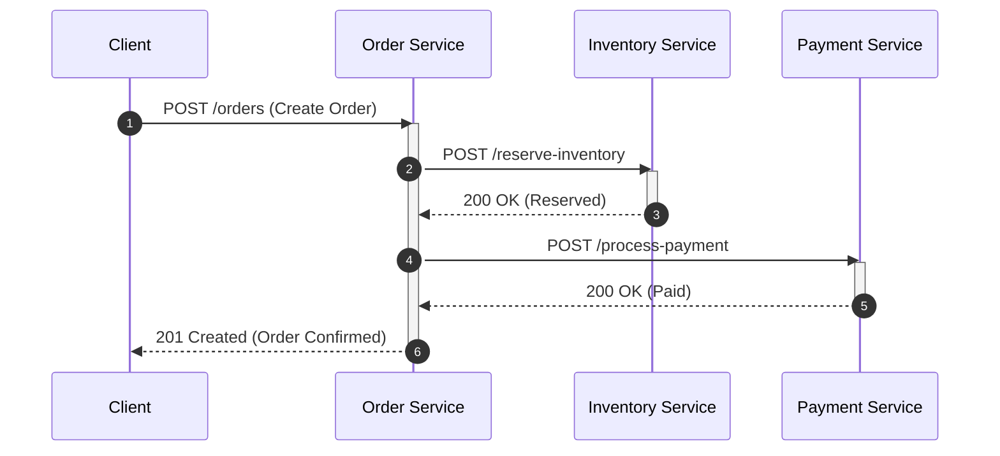
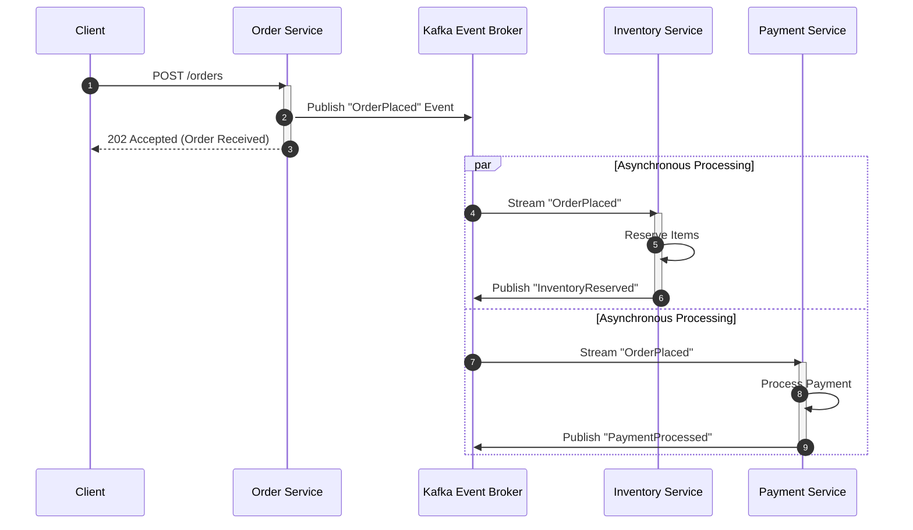

# Architectural Foundations: Event-Driven Systems & Apache Kafka

In modern software engineering, the demand for highly scalable, resilient, and responsive systems has driven a paradigm shift from traditional, synchronous architectures to asynchronous, event-driven patterns. This guide explores the core principles of Event-Driven Architecture (EDA), how Apache Kafka serves as the underlying backbone for these systems, and the architectural trade-offs to consider when choosing this technology stack.

---

## 1. The Paradigm Shift: From Request-Response to Event-Driven

For decades, the dominant pattern for system-to-system communication has been the **Request-Response** model, typically implemented via synchronous protocols like HTTP/REST or gRPC. While intuitive, this approach introduces tight coupling and temporal dependencies between services.



In the diagram above, if the `Payment Service` undergoes a transient outage or experiences high latency, the entire order flow blocks. The `Order Service` must wait, consuming thread pool resources and potentially propagating failures upstream to the client.

### Core Tenets of Event-Driven Architecture (EDA)

An Event-Driven Architecture flips this dependency model. Instead of services actively querying or command-invoking one another, services emit **events** when their internal state changes. Other services listen to these events and react accordingly.

An **event** is a timestamped record of an immutable fact that has occurred within the business domain. Examples include:
*   `OrderPlaced`
*   `InventoryReserved`
*   `PaymentFailed`
*   `UserRegistered`



By decoupling the producer of the event from its consumers, EDA delivers several key advantages:

*   **Temporal Decoupling:** The producer and consumer do not need to be active at the same time. If the `Payment Service` goes offline, the `Order Service` can continue accepting orders and publishing `OrderPlaced` events. When the `Payment Service` recovers, it catches up on the backlog of events at its own pace.
*   **Logical Decoupling:** The `Order Service` has no awareness of which downstream services consume its events. If a new analytics service or notification service needs to react to order placement, it can be added to the system without modifying a single line of code in the `Order Service`.
*   **Backpressure Management:** Consumers read events at their own processing rate (pull-based model), preventing fast producers from overwhelming slower downstream consumers.
*   **Independent Scalability:** Services can be scaled horizontally based on their specific resource requirements and event volume, rather than having to scale the entire synchronous execution path.

---

## 2. The Streaming Engine: How Apache Kafka Powers EDA

Traditional message brokers (like RabbitMQ or ActiveMQ) utilize a queue-based design where messages are deleted immediately after they are successfully acknowledged by a consumer. While effective for simple task distribution, this model falls short when multiple independent services need to read the same stream of data for different purposes.

Apache Kafka re-engineers this model by treating data as an **append-only, distributed commit log**.

### The Log-Centric Architecture

In Kafka, data is stored in **Topics**, which are logical categories or feed names. Each topic is partitioned across multiple nodes (brokers) in the cluster.

```
Topic: order-events
┌────────────────────────────────────────────────────────┐
│ Partition 0: [Offset 0] [Offset 1] [Offset 2] [Offset 3]... (Append Only)
├────────────────────────────────────────────────────────┤
│ Partition 1: [Offset 0] [Offset 1] [Offset 2] ...
├────────────────────────────────────────────────────────┤
│ Partition 2: [Offset 0] [Offset 1] ...
└────────────────────────────────────────────────────────┘
```

*   **Append-Only Commit Log:** When an event is produced, it is written to the end of a partition log. Once written, the event is immutable.
*   **Offsets:** Each message within a partition is assigned a sequential, monotonically increasing integer called an **offset**. Offsets uniquely identify the message's position within that partition.
*   **Consumer Autonomy & Replayability:** Unlike traditional queues, Kafka does not track message delivery status or delete messages when read. Instead, consumers keep track of their own progress by storing their current read offset. Multiple consumers can read from the same partition at different positions and speeds without interfering with each other. This allows developers to "replay" historical events (e.g., to rebuild service state, train machine learning models, or recover from bug-induced failures).

### Scalability, Fault Tolerance, and High Availability

Kafka achieves horizontal scalability and high availability through partitioning and replication:

*   **Horizontal Scaling via Partitions:** Topics are split into partitions. Each partition can reside on a different broker. This allows a single topic to handle throughput far exceeding the storage and processing limits of any individual server.
*   **Partition Keys and Ordering:** By providing a partition key (e.g., `order_id` or `customer_id`), Kafka guarantees that all events with the same key are routed to the exact same partition. Since Kafka guarantees strict message ordering within a single partition, developers can build stateful services confident that events for a specific business entity will be processed in the order they occurred.
*   **Replication and Durability:** Each partition has one **leader** broker and zero or more **follower** brokers. All writes and reads go to the leader, while followers continuously replicate the log. If the leader broker fails, an In-Sync Replica (ISR) is automatically elected as the new leader, ensuring zero data loss and minimal downtime.

---

## 3. High-Value Scenarios: When Kafka is the Right Tool

Apache Kafka excels in distributed environments with high throughput, real-time latency demands, and complex data flows. Key scenarios where Kafka is the optimal architectural choice include:

### Real-Time Event Streaming & Stream Processing
When business operations require immediate action on data in flight, Kafka serves as the ingestion engine. Examples include:
*   **Fraud Detection:** Streaming financial transactions through analytics engines to flag fraudulent activities within milliseconds.
*   **IoT Telemetry:** Ingesting millions of sensor events per second from connected devices, cars, or smart grids to monitor performance and predict failures.

### Event Sourcing & CQRS (Command Query Responsibility Segregation)
In Event Sourcing, the state of an application is not stored as a single snapshot in a relational database, but rather as a sequence of immutable events. 
*   Kafka's durable, ordered log is ideal for keeping the source-of-truth event journal.
*   In CQRS, write models publish events to Kafka, while read models consume those events to build highly optimized, denormalized views for querying.

### Operational Metrics & Distributed Log Aggregation
Large-scale microservice ecosystems generate massive volumes of logs and metrics.
*   Kafka can collect metrics, trace details, and application logs from hundreds of distributed nodes.
*   It routes this telemetry data to centralized storage systems like Elasticsearch, Prometheus, or data warehouses (like Snowflake or BigQuery) without impacting application performance.

---

## 4. Boundaries of the Technology: When Kafka is NOT the Solution

While Kafka is a highly versatile and powerful tool, its distributed nature and log-centric design introduce operational complexity and architectural trade-offs. Using Kafka in the wrong scenarios leads to unnecessary complexity, high maintenance overhead, and sub-optimal performance.

### 1. Traditional Point-to-Point Messaging
If the primary requirement is simple task distribution (e.g., a worker pool pattern where jobs are distributed to workers, processed, and deleted), a traditional message broker is far superior.
*   **The Issue:** Kafka partitions are assigned to consumer instances. If you have 10 partitions, you can have at most 10 active consumers in a consumer group reading in parallel. If one consumer is blocked by a slow task, that entire partition is blocked (Head-of-Line blocking).
*   **Alternative:** Use **RabbitMQ** or **AWS SQS**. They support individual message acknowledgments, selective message routing, dead-letter exchanges, and dynamic scaling of consumer pools without partition limits.

### 2. Complex Querying and Random-Access Database Storage
Although Kafka stores data durably on disk, it is designed for sequential reads and writes, not random-access queries.
*   **The Issue:** You cannot run an ad-hoc query like `SELECT * FROM orders WHERE customer_id = '123' AND status = 'SHIPPED'` directly against a Kafka topic. Doing so requires scanning the entire partition log from the beginning, which is highly inefficient.
*   **Alternative:** Use a relational database (PostgreSQL, MySQL) or a NoSQL database (MongoDB, Cassandra) for transactional state management and query capabilities. Kafka should stream state changes *to* these databases, not replace them.

### 3. Low-Throughput, Resource-Constrained Environments
Kafka is built for scale. Running and maintaining a production-ready Kafka cluster (which historically required Apache ZooKeeper, and now uses KRaft) requires significant operational overhead, memory, and CPU resources.
*   **The Issue:** For small-scale applications or hobby projects with low data volume, setting up, monitoring, and backing up Kafka is over-engineering.
*   **Alternative:** For simple asynchronous processing, utilize lighter alternatives such as **Redis Pub/Sub**, database-backed queues, or serverless event routers (like AWS EventBridge).

### 4. True Request-Response Synchronization
Kafka is fundamentally asynchronous. Attempting to force Kafka into a synchronous request-response flow (where a client waits blockingly for a response to return through a separate Kafka topic) is an anti-pattern.
*   **The Issue:** Implementing a temporary request-response loop over Kafka requires creating temporary reply-to topics or managing complex correlation IDs in memory, which degrades latency and introduces unnecessary points of failure.
*   **Alternative:** Use **gRPC**, **GraphQL**, or **REST** over HTTP/2 for synchronous communication. These protocols are native to immediate, bidirectional client-server interactions.

### 5. Large Payload Transmission
Kafka is optimized for small messages (typically under 1MB).
*   **The Issue:** Publishing large files, videos, or massive PDF documents directly to Kafka topics causes memory pressure on brokers, increases replication latency, and degrades throughput.
*   **Alternative:** Use the **Claim-Check Pattern**. Upload the large payload to a cloud object store (like AWS S3 or Google Cloud Storage) and publish an event to Kafka containing metadata and a reference link (URI) to the file. Downstream consumers can then fetch the payload directly from the object store.

---

## Architectural Decision Matrix

To help guide technology selection, consider the following quick-reference matrix:

| Requirement | Preferred Technology | Why Kafka is/isn't suitable |
| :--- | :--- | :--- |
| **Strict Event Ordering + Replayability** | **Apache Kafka** | Log-centric offsets allow state reconstruction and multiple independent consumers. |
| **Complex Message Routing & Transient Queues** | **RabbitMQ / SQS** | Native support for AMQP routing keys, wildcard bindings, and individual message deletion. |
| **High-Performance Random Read/Write Queries** | **PostgreSQL / Cassandra** | Kafka only supports sequential log scanning. |
| **Microsecond-level Synchronous API Calls** | **gRPC / REST** | Kafka is fundamentally asynchronous and decoupled. |
| **Massive File Transfers (>10MB)** | **S3 / GCS + Kafka Metadata** | Storing large binary payloads in Kafka degrades cluster throughput and increases replication lag. |
