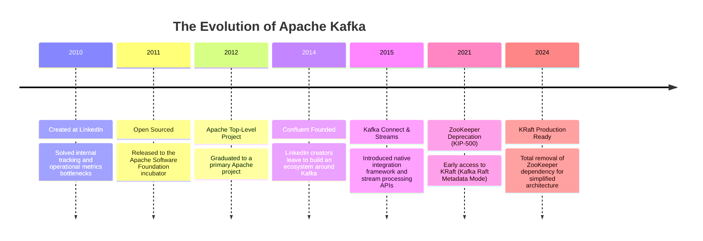
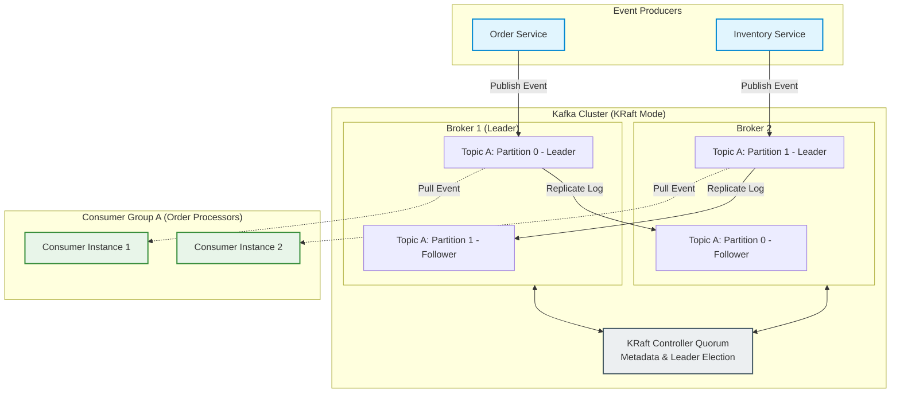

# Deep Dive into Apache Kafka: Origin, Core Capabilities, and Architecture

Apache Kafka is the de facto standard for distributed event streaming. In this guide, we explore what Kafka is, trace its evolutionary journey, and break down its architectural components.

---

## 1. What is Apache Kafka?

At its core, **Apache Kafka** is a open-source, distributed event streaming platform designed to handle massive volumes of real-time data. Rather than functioning as a transient database or a simple message queue, Kafka behaves as a highly scalable, fault-tolerant, and distributed append-only commit log.

Kafka is defined by three primary capabilities:

1.  **Publish and Subscribe:** Publish (write) and subscribe to (read) streams of events, similar to a traditional message queue or enterprise messaging system.
2.  **Store Durably:** Store streams of events durably and reliably on disk for as long as desired (retention can be configured from hours to forever).
3.  **Process in Real-Time:** Process streams of events as they occur, using stream processing libraries like Kafka Streams or external stream processing frameworks (such as Apache Flink or Spark Streaming).

---

## 2. A Brief History & Evolution

Kafka was originally created at **LinkedIn** around 2009 to solve a massive infrastructure bottleneck. LinkedIn needed to ingest, track, and process user activity data (clicks, impressions, page views) and operational metrics at scale. Traditional messaging queues (like ActiveMQ) and batch integration processes (like ETL pipelines) were failing under the load.

To address this, LinkedIn engineers Jay Kreps, Neha Narkhede, and Jun Rao designed Kafka from the ground up as a distributed, partition-based log. They named it after the author Franz Kafka because it was optimized for writing.

### Timeline of Major Milestones

---

## 3. Core Architecture & Components

Kafka’s architecture is built on a distributed cluster design. To understand how it operates under the hood, we must examine its key structural components:

*   **Brokers:** A Kafka cluster consists of one or more servers called brokers. Brokers receive, store, and serve event records.
*   **Producers:** Applications that write events to Kafka topics. Producers decide which partition to write to (often using key-based hashing).
*   **Consumers:** Applications that subscribe to and read events from topics.
*   **Consumer Groups:** A coordinating group of consumers that cooperate to read from a topic. Each partition in a topic is consumed by exactly one consumer within a group, allowing parallel load distribution.
*   **Metadata Controller (KRaft/ZooKeeper):** The control plane coordinates the cluster, keeps track of active brokers, assigns partition leaders, and manages topic metadata. Modern clusters use **KRaft** (Kafka Raft Metadata Mode), which replaces external Apache ZooKeeper instances with an internal consensus protocol.

### Architectural Block Diagram

The following diagram illustrates how these components interact:

### Partitioning & Replication Internals

Kafka scales horizontally by dividing topics into **Partitions**.

1.  **Scaling Read/Write Throughput:** Multiple producers can write to different partitions of the same topic simultaneously, and multiple consumers can read from different partitions concurrently.
2.  **Leader-Follower Replication Pattern:** 
    *   For each partition, one broker is designated as the **Leader**, and other brokers are **Followers**.
    *   The **Leader** handles all client writes and reads.
    *   The **Followers** act as shadow replicas, constantly pulling data from the leader to keep their copy of the partition log updated.
    *   If the leader broker fails, the controller Quorum instantly promotes one of the in-sync followers to be the new leader, maintaining continuous availability.
