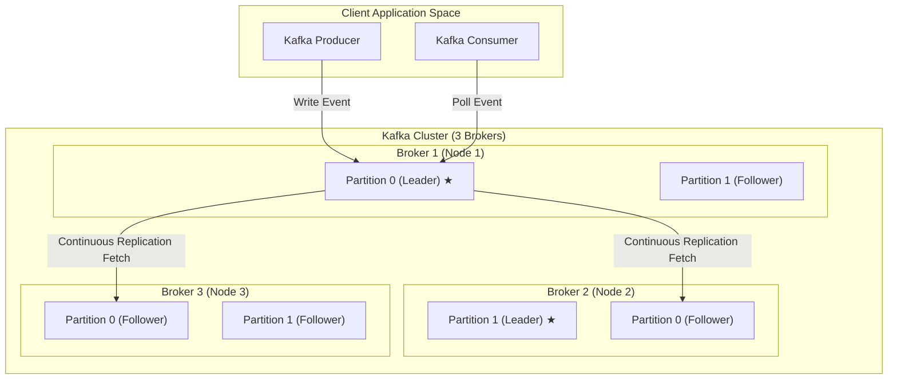

# Kafka Deep Dive: Topics, Partitions, and Replication

To design highly performant, resilient event-driven systems, it is essential to understand how Apache Kafka stores, distributes, and protects message streams. This guide explores the physical storage model of **Topics** and **Partitions**, how Kafka ensures message ordering, and how **Replication** guarantees high availability and data durability.

---

## 1. Topics and Partitions: The Storage Blueprint

In Kafka, a **Topic** is a logical name for a stream of records (similar to a table name in a database). Under the hood, a topic is divided into one or more **Partitions**.

```
Topic: user-clicks
 ┌──────────────────────────────────────────────────────────┐
 │ PARTITION 0: [Offset 0] [Offset 1] [Offset 2] [Offset 3] │ -> Stored on Broker 1
 ├──────────────────────────────────────────────────────────┤
 │ PARTITION 1: [Offset 0] [Offset 1] [Offset 2]            │ -> Stored on Broker 2
 ├──────────────────────────────────────────────────────────┤
 │ PARTITION 2: [Offset 0] [Offset 1] [Offset 2] [Offset 4] │ -> Stored on Broker 3
 └──────────────────────────────────────────────────────────┘
```

*   **Logical vs. Physical:** A Topic is a logical abstraction. A Partition is the physical unit of storage on a broker.
*   **The Commit Log:** Each partition is stored on disk as a directory containing append-only log segments. Incoming events are simply appended to the end of the partition log. Once written, records are immutable and cannot be modified or deleted.
*   **Offsets:** Each message within a partition is assigned a sequential, unique index number called an **offset**. Offsets start at `0` for the first message and increase monotonically.

### Partitioning Keys and Message Routing
When a producer publishes a message, it can optionally specify a **Key** (e.g., `customer_id` or `order_id`):

1.  **Keyless Messages (Null Keys):** By default, if no key is provided, the producer distributes messages randomly or round-robin across partitions (often utilizing a batching strategy like sticky partitioning).
2.  **Keyed Messages:** If a key is provided, the producer applies a hashing algorithm (`murmur2(key) % total_partitions`) to calculate the destination partition. This guarantees that **all messages with the exact same key will always land in the same partition**.

### Message Ordering Guarantees
*   **Ordered within a Partition:** Kafka guarantees strict, chronological message ordering **only within a single partition**.
*   **No Global Ordering:** There is no ordering guarantee across different partitions of a topic. If your consumer reads from Partitions 0, 1, and 2, it will process messages in the order they were written *inside* each partition, but their inter-partition interleaving is non-deterministic.
*   **Architectural Rule:** If chronological processing is critical for your business flow (e.g., you must process `OrderCreated` before `OrderPaid` for a specific transaction), you must use the same key (like `order_id`) to ensure they route to the same partition.

---

## 2. Understanding Offsets and Consumer Progress

An **offset** is a 64-bit sequential integer assigned to each record when it is written to a partition. It acts as the coordinate or address of a message inside the partition log. 

To track data streams and monitor processing health, Kafka uses three distinct offset metrics:

```
                  Partition Log Segment
 ┌──────────────────────────────────────────────────────────┐
 │ [Offset 0]  [Offset 1]  [Offset 2]  [Offset 3]  [Offset 4]│ ... (Append Log)
 └─────────────────────────────▲───────────▲───────────▲────┘
                               │           │           │
                     Consumer Offset    High Water   Log End
                        (Committed)     (HW Commit)  Offset (LEO)
```

1.  **Log End Offset (LEO):** The offset of the *next* message to be written to the partition. LEO advances every time a producer successfully publishes a record.
2.  **High Watermark (HW):** The offset of the last message that has been successfully replicated by all In-Sync Replicas (ISR). Consumers cannot read past the High Watermark, protecting them from reading uncommitted data.
3.  **Current Consumer Offset:** The offset of the next message that the consumer group is scheduled to read. As consumers process messages, they periodically notify Kafka of their progress by "committing" their offset. These commits are stored in an internal, highly compacted Kafka topic named `__consumer_offsets`.

### What is Consumer Lag?
**Consumer Lag** is the difference between the partition's latest available offset and the consumer's committed offset:

$$\text{Consumer Lag} = \text{Log End Offset} - \text{Current Consumer Offset}$$

*   **Lag = 0:** The consumer has read all available records and is processing events in real-time.
*   **Lag > 0:** The consumer is behind. This indicates that the consumer application is processing messages slower than the producer is writing them, or that the consumer has crashed. Monitoring consumer lag is the primary way to evaluate the health of a streaming topology.

### Offset Commit Semantics
How a consumer commits offsets determines its delivery guarantees:

*   **At-Least-Once (Default):** The consumer reads messages, processes them, and then commits the offset. If the consumer crashes *after* processing the data but *before* committing, the new consumer instance will re-read the processed messages from the last committed offset, leading to potential duplicate processing.
*   **At-Most-Once:** The consumer reads messages, commits the offsets immediately, and then processes the data. If the consumer crashes during processing, the unprocessed messages will be skipped when the consumer recovers, leading to data loss.
*   **Exactly-Once Processing (Transactional):** Achieved by writing offsets and output events in a single transaction (via the Kafka Transactions API) so that commits and data writes succeed or fail together.

---

## 3. Partition Replication: Designing for Resilience

To prevent data loss and maintain continuous availability in the event of hardware failures, Kafka replicates partitions across multiple brokers. The number of replicas is defined by the **Replication Factor (RF)** (typically set to `3` in production).

### Leader vs. Follower Replicas
For any given partition, one broker is designated as the **Leader**, and the other brokers hosting the replicas are **Followers**.



1.  **The Leader Replica:** Handles all read and write requests from client producers and consumers. There is only one leader per partition.
2.  **Follower Replicas:** Do not serve clients (unless specifically configured for locality-aware reads). Instead, they act as active shadow standbys, continuously fetching new records from the leader to keep their local commit logs in sync.
3.  **Failover:** If the broker holding the partition leader goes offline, the KRaft control plane quorum detects the failure and instantly promotes one of the in-sync followers to become the new leader. Clients automatically re-route their requests to the new leader within milliseconds.

---

## 3. Durability Guarantees: ISR, Acks, and High Watermarks

To balance data safety against write latency, Kafka exposes several critical configuration parameters.

### In-Sync Replicas (ISR)
The **In-Sync Replicas (ISR)** list is the subset of follower replicas that are actively caught up with the leader. A follower is considered "in-sync" if it has successfully replicated the leader's log within a configurable heartbeat window (controlled by `replica.lag.time.max.ms`, defaulting to 30 seconds). If a follower falls too far behind due to network congestion or server lag, it is temporarily ejected from the ISR list.

### Write Acknowledgment (`acks`)
Producers specify how many replicas must acknowledge a write before the write is considered successful. This is configured using the `acks` property:

*   **`acks=0` (Fire-and-Forget):** The producer writes the message to the socket buffer and considers it sent. It does not wait for a response from the broker. This is extremely fast but highly unsafe (data will be lost if the broker crashes).
*   **`acks=1` (Leader Acknowledged):** The producer waits for the partition leader broker to write the message to its local log before acknowledging. This protects against network dropouts but still exposes data to loss if the leader broker crashes before followers can replicate the log.
*   **`acks=all` (or `-1`) (Fully Replicated):** The producer waits for the leader and **all active in-sync replicas (ISR)** to write the message. This provides the highest durability guarantee.

### `min.insync.replicas` Configuration
When using `acks=all`, what happens if two of your three brokers crash? If only the leader is alive, the ISR size is 1. If the leader writes the message, it technically writes to "all members of the ISR" (which is just itself) and returns success. If the leader then crashes, the data is lost.

To prevent this, you configure **`min.insync.replicas`** (typically set to `2` for a replication factor of 3):
*   This setting defines the minimum number of in-sync replicas that must acknowledge a write when `acks=all` is specified.
*   If the number of online brokers in the ISR drops below this minimum threshold, the leader will refuse write requests, throwing a `NotEnoughReplicasException` or `NotEnoughReplicasAfterAppendException`. This turns off topic writes temporarily to protect data integrity, ensuring you never write data that cannot be safely replicated.

### The High Watermark (HW)
The **High Watermark (HW)** is the offset of the last message that has been successfully replicated by all replicas in the ISR. 
*   **Committed Messages:** Messages below the High Watermark are considered "committed".
*   **Consumer Isolation:** Kafka consumers are only allowed to read up to the High Watermark. Even if a producer writes a message at offset `10` to the leader, consumers cannot see it until that message has been replicated to the followers and the High Watermark advances to `10`. This prevents consumers from reading dirty, un-replicated data that could be lost in a broker crash.
