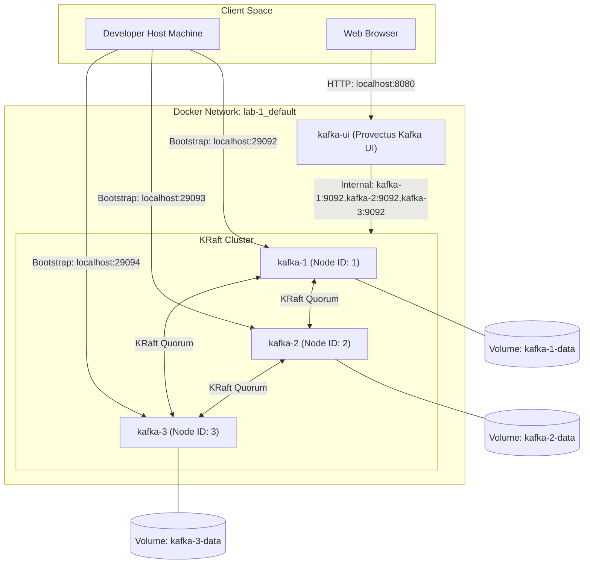

# Lab 1: Multi-Broker KRaft Cluster Setup

This lab provides a configuration and guide to spin up a local, highly available 3-node Apache Kafka cluster using **KRaft** (Kafka Raft Metadata Mode) without ZooKeeper, along with a web-based management UI.

---

## Architecture Overview

The topology consists of four containerized services orchestrated via Docker Compose:



### Components

1.  **Three Kafka Servers (`kafka-1`, `kafka-2`, `kafka-3`):**
    *   Each server runs as both a **Broker** (handling data reads/writes) and a **Controller** (participating in metadata consensus).
    *   No external ZooKeeper is needed. They coordinate state using the KRaft consensus algorithm under a shared cluster ID (`4L62GSZSR56SBpZZtVpBGA`).
2.  **Persistent Storage Volumes (`kafka-1-data`, `kafka-2-data`, `kafka-3-data`):**
    *   Docker-managed volumes mounted to `/var/lib/kafka/data` in each container.
    *   Ensures that topics, configuration, and messages survive container restarts or teardowns (`docker-compose down`).
3.  **Kafka UI (`kafka-ui`):**
    *   A dashboard running on port `8080` that lets you inspect brokers, topics, consumers, offsets, and messages, as well as create and configure topics manually.

---

## How to Run the Lab

### Prerequisites

*   Docker installed and running.
*   Docker Compose (version V2 recommended).
*   At least 4GB of RAM allocated to the Docker Engine.

### 1. Start the Cluster

From the `lab-1` directory, run:

```bash
docker compose up -d
```

This starts all three Kafka brokers and the UI in the background.

### 2. Verify Services are Running

Check the status of the containers:

```bash
docker compose ps
```

You should see all 4 containers (`kafka-1`, `kafka-2`, `kafka-3`, and `kafka-ui`) in the `Up` state.

---

## Usage Guide

### 1. Accessing the Web Dashboard (Kafka UI)

Open your web browser and navigate to:
*   [http://localhost:8080](http://localhost:8080)

Here you can:
*   View overall cluster health, broker states, and configurations.
*   Create a new topic (e.g. `test-topic`) with custom partition and replica counts.
*   Produce test messages directly from the UI and view incoming streams.

### 2. Interacting via Command Line (from Host Machine)

Since the brokers expose ports `29092`, `29093`, and `29094` to your host machine, you can interact with the cluster using local CLI tools.

#### Create a Topic
Create a topic named `my-replicated-topic` with **3 partitions** and a **replication factor of 3**:

```bash
docker exec -it kafka-1 kafka-topics --create \
  --bootstrap-server localhost:9092 \
  --topic my-replicated-topic \
  --partitions 3 \
  --replication-factor 3
```

#### Describe the Topic
Verify that the partitions and replicas are distributed across the 3 brokers:

```bash
docker exec -it kafka-1 kafka-topics --describe \
  --bootstrap-server localhost:9092 \
  --topic my-replicated-topic
```

#### Produce Messages
Start a console producer to publish messages:

```bash
docker exec -it kafka-1 kafka-console-producer \
  --bootstrap-server localhost:9092 \
  --topic my-replicated-topic
```
*Type a few messages (e.g., "Hello Kafka", "Testing KRaft replication") and press `Enter` after each. Press `Ctrl+C` to exit.*

#### Consume Messages
Start a console consumer to read from the beginning of the log:

```bash
docker exec -it kafka-1 kafka-console-consumer \
  --bootstrap-server localhost:9092 \
  --topic my-replicated-topic \
  --from-beginning
```
*You will see the messages you typed previously.*

---

## Cleanup and Data Persistence

### Stopping the Cluster (Keeping Data)

To temporarily stop the cluster without losing your created topics or published messages:

```bash
docker compose stop
```

You can resume using `docker compose start`.

### Tearing Down the Cluster (Keeping Data)

To remove the containers but keep the volumes intact:

```bash
docker compose down
```

The next time you run `docker compose up -d`, all topics and messages will be loaded from the volumes.

### Tearing Down the Cluster and Deleting All Data

To fully remove the containers and **delete all data** (clean slate):

```bash
docker compose down -v
```
