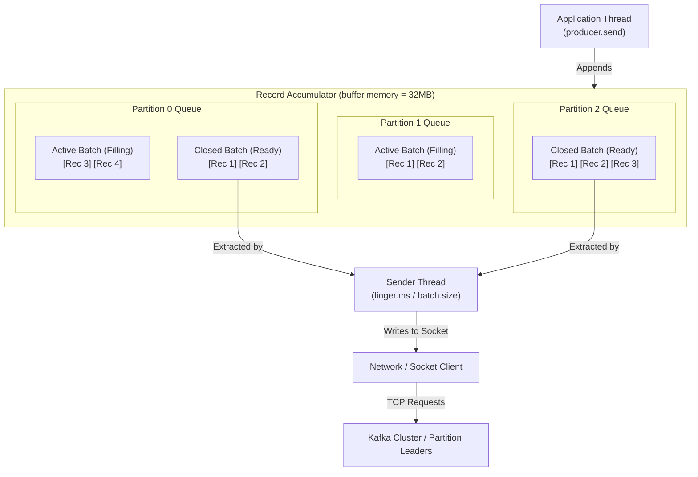

# Kafka Producer Reference Guide

This guide provides a comprehensive reference on Kafka Producers, covering key API abstractions, details on configuration properties, internal architecture, and coding patterns.

---

## 1. Introduction 

### What is a Kafka Producer?
In event-driven architectures (EDA), a Kafka Producer is the client application responsible for generating and sending data to a Kafka cluster. It acts as the "source of truth" in the pipeline, turning application-level events (such as user signups, sensor readings, or financial transactions) into byte streams stored in Kafka topics.

### Message Lifecycle & Workflow (From Client to Cluster)
When a producer client publishes a message, it goes through a coordinated sequence of internal steps:
1. **Instantiation & Initialization:** The client initializes the `KafkaProducer`, starts a background sender thread, and allocates a memory pool (`buffer.memory`, defaulting to 32MB) to hold unsent messages.
2. **Serialization & Partitioning:** The application calls `.send(ProducerRecord)`. The serializer converts key/value objects into byte arrays. The partitioner then determines the target partition using key hashing (`hash(key) % partitionCount`) or sticky partitioning (if key is null).
3. **Buffering in Memory:** The message is appended to the **Record Accumulator**, which buffers messages in memory partitioned by topic-partition. Each partition buffer consists of batches.
4. **Batching & Lingering:** Rather than sending records one-by-one, the background sender thread aggregates records. It waits until a batch reaches its maximum byte size (`batch.size`, defaulting to 16KB) or until a configured delay (`linger.ms`) has elapsed to form a larger request, minimizing network overhead.
5. **Broker Transmission & Acknowledgements:** The sender thread packages these batches into single socket requests per broker. The broker processes the write and sends an acknowledgement based on `acks` (e.g., `0` for none, `1` for leader write, `all` for all in-sync replicas).
6. **Retries & Error Recovery:** If a transient exception occurs (like a network timeout or partition election), the producer automatically retries sending the batch. It will retry up to the configured limit (`retries`) at intervals controlled by `retry.backoff.ms` until the `delivery.timeout.ms` limit is reached.

#### Buffer and Batch Architecture (Visual Representation)
The diagram below illustrates how individual messages (records) are appended to partition-specific queues in the record accumulator memory buffer, grouped into batches, and processed by the sender thread:



### Scenario Context: Payment Processing System
Throughout this guide, we use the **Payment Processing & Fraud Detection System** as our business scenario.
* **The Producer's Role:** The Payment Service acts as the producer. Every time a customer initiates a payment, it publishes a `Transaction` event containing:
  ```json
  {
    "transactionId": "TXN-101",
    "customerId": "CUST-500",
    "amount": 25000.0
  }
  ```
* **Goal:** Publish these transactions reliably, ensuring they preserve customer-level ordering and are optimized for high throughput without losing messages.

---

## 2. Key Java Classes & Interfaces

To write a Kafka producer, developers interact with several core classes and interfaces inside the `org.apache.kafka.clients.producer` package.

### 1. `KafkaProducer<K, V>` (Class)
The entry point. It is a thread-safe client that holds connection pools to brokers, manages background sender threads, and buffers messages in memory.
* *Key methods:*
  * `send(ProducerRecord)`: Places a record in the local buffer to be sent asynchronously.
  * `send(ProducerRecord, Callback)`: Sends a record and triggers a callback when acknowledged.
  * `flush()`: Blocks until all buffered records are sent.
  * `close()`: Closes the producer cleanly, flushing any remaining records.

### 2. `ProducerRecord<K, V>` (Class)
Represents the message entity to be sent. It wraps:
* `topic` (String, required): The target Kafka topic.
* `partition` (Integer, optional): The specific partition ID.
* `key` (K, optional): Used for partitioning routing and log compaction.
* `value` (V, required): The actual payload.
* `headers` (Headers, optional): Key-value metadata attached to the message.

### 3. `RecordMetadata` (Class)
Returned by the broker when a record is successfully written. It contains:
* `partition()`: The partition the record was written to.
* `offset()`: The sequential offset assigned to the message.
* `timestamp()`: The record timestamp.

### 4. `Callback` (Interface)
An asynchronous handler containing a single method:
* `onCompletion(RecordMetadata metadata, Exception exception)`
Note that one of these parameters will always be `null` (e.g., if `exception != null`, write failed; if `exception == null`, write succeeded).

### 5. `Serializer<T>` (Interface)
Defines how Java objects are converted into byte arrays (`byte[]`). 
* *Key methods:* `serialize(String topic, T data)`.
* Built-in serializers include `StringSerializer`, `DoubleSerializer`, and `ByteArraySerializer`.

### 6. `Partitioner` (Interface)
Defines the routing logic to map a message to a partition.
* *Key methods:* `partition(String topic, Object key, byte[] keyBytes, Object value, byte[] valueBytes, Cluster cluster)`.

---

## 3. Core Configuration Properties

Before instantiating a `KafkaProducer`, developers define a `Properties` map. The following configuration properties dictate behavior:

### Essential Configurations (Bootstrapping & Serialization)
* **`bootstrap.servers`** (Type: String, Default: *None*):
  A comma-separated list of host:port pairs indicating the brokers the producer connects to initially to discover cluster topology.
* **`key.serializer`** (Type: Class, Default: *None*):
  Serializer class for keys (e.g., `org.apache.kafka.common.serialization.StringSerializer`).
* **`value.serializer`** (Type: Class, Default: *None*):
  Serializer class for values.

### Reliability & Durability Configurations
* **`acks`** (Type: String, Default: `all`):
  Controls acknowledgement criteria.
  * `0`: Fire-and-forget.
  * `1`: Leader broker must write to its log.
  * `all` (or `-1`): Leader + In-Sync Replicas (ISRs) must write to log.
* **`retries`** (Type: Integer, Default: `2147483647`):
  Maximum retries for transient errors.
* **`enable.idempotence`** (Type: Boolean, Default: `true`):
  Ensures exactly-once delivery per partition, preventing duplicates during retries.

### Performance & Throughput Configurations
* **`batch.size`** (Type: Integer, Default: `16384` bytes / 16KB):
  Size limit for partition batches.
* **`linger.ms`** (Type: Long, Default: `0`):
  Wait time to pool more messages into a batch before sending.
* **`compression.type`** (Type: String, Default: `none`):
  Compression codec (`gzip`, `snappy`, `lz4`, `zstd`).
* **`buffer.memory`** (Type: Long, Default: `33554432` bytes / 32MB):
  Total memory pool size for buffering records.

---

## 4. Producer Architecture & Message Journey

```text
                                  PRODUCER CLIENT ARCHITECTURE
┌────────────────────────────────────────────────────────────────────────────────────────┐
│  Application                                                                           │
│       │                                                                                │
│       ▼                                                                                │
│  [Producer API] ────(Wraps into ProducerRecord)                                        │
│       │                                                                                │
│       ▼                                                                                │
│  [Serializer] ──────(Converts key/value objects to raw byte arrays)                     │
│       │                                                                                │
│       ▼                                                                                │
│  [Partitioner] ─────(Determines target partition: Key hashing or Sticky)               │
│       │                                                                                │
│       ▼                                                                                │
│  [Record Accumulator]                                                                  │
│  ┌──────────────────────────────────────────────────────────────────────────────────┐  │
│  │ Memory Buffer Pool (buffer.memory)                                               │  │
│  │  Topic: transactions                                                             │  │
│  │    ├── Partition 0 Batch: [M1][M2] (linger.ms / batch.size trigger)               │  │
│  │    ├── Partition 1 Batch: [M3][M4]                                                │  │
│  │    └── Partition 2 Batch: [M5]                                                    │  │
│  └────────────────────┬─────────────────────────────────────────────────────────────┘  │
└───────────────────────┼────────────────────────────────────────────────────────────────┘
                        │ (Triggered by linger.ms / batch.size / flush())
                        ▼
            ┌───────────────┐
            │ Sender Thread │
            └───────┬───────┘
                    ▼
       ┌─────────────────────────┐
       │ Network Client (Socket) │
       └────────────┬────────────┘
                    │ (Acks: 0, 1, all)
                    ▼
             [Kafka Brokers]
```

1. **Metadata Fetching:** At startup, the producer queries `bootstrap.servers` to retrieve cluster metadata (broker layout, partition leaders, and in-sync replicas). It caches this mapping and refreshes it if writes encounter a leader failover.
2. **Serialization:** Converts keys and values into byte streams.
3. **Partition Selection:**
   * If a key is present, computes `hash(key) % partitionCount` to identify the partition.
   * If the key is null, uses the **Uniform Sticky Partitioner** to fill partition batches sequentially, optimizing network resource utilization.
4. **Buffering & Accumulating:** The thread calling `.send()` pushes records into memory batches inside the `RecordAccumulator`. It is not sent immediately.
5. **Socket Transmission:** The background `Sender` thread fetches full batches and sends them to the appropriate brokers in single network packets.

---

## 5. Programming Patterns & Code Examples

Here are the three fundamental code implementation patterns based on your workspace reference project.

### Pattern 1: Fire-and-Forget (No Confirmation)
This pattern involves calling the `.send()` method of `KafkaProducer` without capturing the return value (`Future`) or registering a callback. The producer sends the record to the broker's buffer and proceeds immediately, without waiting to see if it was successfully written. It is commonly used in logging or metrics aggregation pipelines where speed is critical and occasionally losing a message is acceptable.

```java
// Setup properties
Properties props = new Properties();
props.put("bootstrap.servers", "localhost:9092,localhost:9093");
props.put("key.serializer", "org.apache.kafka.common.serialization.StringSerializer");
props.put("value.serializer", "org.apache.kafka.common.serialization.StringSerializer");

KafkaProducer<String, String> producer = new KafkaProducer<>(props);

Transaction tx = new Transaction("TXN-1", "CUST-1", 10000);
String json = JsonUtil.toJson(tx);
ProducerRecord<String, String> record = new ProducerRecord<>("transactions", json);

// Fire and forget
producer.send(record); 
producer.close();
```

### Pattern 2: Synchronous Send (Blocking)
This pattern forces the application thread to block and wait until the broker acknowledges the write. The `.send()` method returns a Java `Future<RecordMetadata>`. By calling `.get()` on this future, the application halts execution until the broker returns the metadata (partition, offset) or throws an exception. This guarantees message delivery confirmation before proceeding, making it suitable for critical events, but severely limits throughput.

```java
// Blocks application thread until acknowledgment is returned
try (KafkaProducer<String, String> producer = new KafkaProducer<>(props)) {
    ProducerRecord<String, String> record = new ProducerRecord<>("transactions", json);
    
    // Calling .get() forces the thread to block until receipt confirmation
    RecordMetadata metadata = producer.send(record).get(); 
    
    System.out.printf("Sync Write Complete! Partition: %d, Offset: %d%n", 
            metadata.partition(), metadata.offset());
}
```

#### Impact on Batching and Buffering
When using the Synchronous pattern:
* **Batching is completely bypassed:** Although the producer is configured with a `batch.size` (e.g., 16KB) and `linger.ms` (e.g., 100ms), no two messages will ever be grouped into a single batch. Because the application thread blocks on `.get()` after calling `.send()`, the producer client has no choice but to immediately dispatch the single record currently in the partition buffer to retrieve its metadata and unblock the thread.
* **Network Overhead increases:** The network behaves as a strict "stop-and-wait" link. Each record generates its own individual roundtrip network request and response, introducing high TCP overhead and broker CPU usage.
* **Buffer Memory Inefficiency:** The memory space allocated in `buffer.memory` (32MB by default) serves no functional purpose because records are never allowed to accumulate. It acts merely as a single-record passthrough channel.

### Pattern 3: Asynchronous Send with Callbacks (Recommended)
This pattern is the standard for production workloads. The application invokes `.send()` and passes a `Callback` implementation along with the record. The send call returns immediately, allowing the application to continue publishing messages. Once the broker replies, the Kafka producer library executes the callback asynchronously. This provides high throughput through non-blocking I/O while still allowing error handling and reporting.

```java
try (KafkaProducer<String, String> producer = new KafkaProducer<>(props)) {
    ProducerRecord<String, String> record = new ProducerRecord<>("transactions", json);

    // Non-blocking send. We pass an anonymous Callback implementation
    producer.send(record, (metadata, exception) -> {
        if (exception == null) {
            System.out.printf("Async Success: Partition=%d Offset=%d%n", 
                    metadata.partition(), metadata.offset());
        } else {
            exception.printStackTrace(); // Handle transmission errors
        }
    });
    producer.flush(); // Ensure lingering batches are pushed
}
```

Passing `customerId` as a key guarantees ordering for specific entities:
```java
// customerId is passed as the key
ProducerRecord<String, String> record = new ProducerRecord<>("transactions", customerId, json);
```

---

## 6. Advanced Reliability & Tuning Recipes

### How Idempotence Prevents Duplicates
The following scenario illustrates how idempotence works:
1. Producer sends message `Seq=0`.
2. Broker writes message, but the connection drops before the `Ack` reaches the producer.
3. Producer retries, resending `Seq=0`.
4. Without idempotence, the broker appends `Seq=0` twice (duplicate!).
5. With `enable.idempotence=true`, the broker matches the incoming sequence number with its logs, discards the duplicate, and replies with an `Ack`.

### Common Tuning Profiles
```properties
# Profile 1: Maximum Reliability (Payments)
acks=all
enable.idempotence=true
retries=2147483647
max.in.flight.requests.per.connection=5

# Profile 2: Maximum Throughput (Reporting/Log Aggregation)
acks=1
linger.ms=50
batch.size=32768
compression.type=snappy
```
