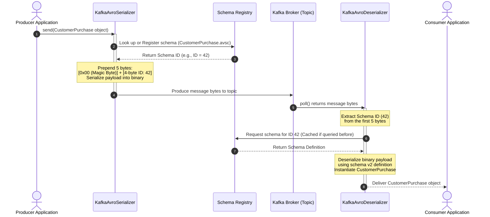

# Apache Avro & Schema Registry Reference Guide

This guide provides a comprehensive reference on Apache Avro and Confluent Schema Registry in the context of Apache Kafka, covering schemas, code generation, serialization/deserialization, schema evolution, and development workflows.

---

## 1. Introduction

### What is Apache Avro?
Apache Avro is a language-neutral data serialization system. It is a binary, schema-based serialization framework that compiles data structures defined in JSON-based schemas into a highly compact, efficient binary payload. 

In event-driven microservices using Apache Kafka, Apache Avro acts as the standard serialization format because it solves the main challenges of data sharing, data contracts, and long-term evolutionary compatibility.

### Why Not JSON? (The Case for Avro)
While JSON is human-readable and widely supported, it has severe limitations when used as a message format in high-throughput event streaming systems:

| Feature | JSON | Apache Avro | Impact on Kafka Systems |
| :--- | :--- | :--- | :--- |
| **Payload Size** | Large (Field names repeated in every message) | Very Small (Binary payload containing only values) | **Avro reduces network I/O and storage costs** by 50% to 80% compared to JSON. |
| **Parsing Cost** | High CPU overhead (String scanning & parsing) | Low CPU overhead (Direct binary-to-object mapping) | **Avro improves throughput and reduces latency** for producers and consumers. |
| **Data Contract** | Weak/Implicit (No built-in schema enforcement) | Strong/Explicit (A mandatory schema governs data structure) | **Avro prevents "poison pills"**—invalid or malformed payloads that crash consumers. |
| **Schema Evolution** | Hard to track and enforce safely | Built-in support (Allows adding/deleting fields safely) | **Avro allows independent deployments** of producers and consumers without breaking changes. |

#### JSON vs. Avro Payload Comparison
Consider the `CustomerPurchase` event:
* **JSON Payload (65 bytes):**
  ```json
  {"customerId":"C1001","purchaseAmount":1500.00,"pointsEarned":150}
  ```
* **Avro Payload (15 bytes):**
  ```text
  [Binary bytes representing: "C1001", 1500.00, 150]
  ```
  *(Avro does not write field names like `"customerId"` into the message. Instead, it only serializes the values, relying on the schema to decode what those values mean.)*

### Confluent Schema Registry Overview
Since Avro messages do not contain the schema definition (to save space), consumers must have access to the exact schema that was used to write the message in order to deserialize it. 

**Confluent Schema Registry** solves this problem by:
1. Serving as a centralized repository for storing and versioning schemas.
2. Providing a unique 4-byte Schema ID for each registered schema version.
3. Checking and enforcing compatibility rules (e.g., preventing producers from registering schema changes that would break existing consumers).

---

## 2. Key Java Classes & Interfaces

To write Java applications using Avro and Kafka, you interact with classes from the Apache Avro library and Confluent serializers:

### 1. `Schema` (`org.apache.avro.Schema`)
The programmatic representation of an Avro schema (parsed from a `.avsc` JSON file). It is used to inspect schema fields, types, and properties at runtime.

### 2. `SpecificRecord` (`org.apache.avro.generic.SpecificRecord`)
An interface implemented by all Java classes generated from an Avro schema (e.g., `CustomerPurchase`). Classes implementing this interface provide type-safe getters and setters, and can write and read themselves using specific writers/readers.

### 3. `GenericRecord` (`org.apache.avro.generic.GenericRecord`)
An interface used when you do not want to use code generation. You can construct and read records dynamically using key-value lookups (e.g., `record.put("customerId", "C1001")`). This is useful for generic utilities like ETL pipelines or database connectors.

### 4. `KafkaAvroSerializer` (`io.confluent.kafka.serializers.KafkaAvroSerializer`)
A Kafka `Serializer` implementation that converts Avro-generated Java objects (`SpecificRecord` or `GenericRecord`) into byte arrays. During serialization, it:
* Extracts the schema from the Java object.
* Registers the schema with the Schema Registry (if it doesn't already exist).
* Retrieves the unique **Schema ID** for the schema.
* Prepends a **5-byte header** (containing the Schema ID) to the binary payload before sending it to Kafka.

### 5. `KafkaAvroDeserializer` (`io.confluent.kafka.serializers.KafkaAvroDeserializer`)
A Kafka `Deserializer` implementation that converts byte arrays back into Avro objects. During deserialization, it:
* Extracts the 4-byte **Schema ID** from the message's 5-byte header.
* Queries the Schema Registry to fetch the writer's schema corresponding to that ID.
* Decodes the binary payload using the fetched schema.
* Maps the data to a type-safe generated Java class (if `specific.avro.reader=true`) or a `GenericRecord`.

### 6. `SpecificDatumWriter<T>` & `SpecificDatumReader<T>`
Low-level Avro classes that serialize and deserialize specific Java objects. 
* `SpecificDatumWriter`: Converts a Java object of a generated class into binary.
* `SpecificDatumReader`: Reads binary data and instantiates a specific Java object.

---

## 3. Core Configuration Properties

When configuring Kafka Producers and Consumers to use Avro, you specify the following properties:

### 1. `schema.registry.url` (Type: String)
* **Required** for both producer and consumer.
* The HTTP URL of the Confluent Schema Registry cluster (e.g., `http://localhost:8081`).
* **Example:**
  ```properties
  schema.registry.url=http://localhost:8081
  ```

### 2. `specific.avro.reader` (Type: Boolean)
* **Used by Consumers** (configured via `KafkaAvroDeserializerConfig.SPECIFIC_AVRO_READER_CONFIG`).
* **`true` (Recommended):** Tells the deserializer to return instances of the generated class (e.g., `CustomerPurchase`).
* **`false` (Default):** Tells the deserializer to return a generic `GenericRecord` container.
* **Example:**
  ```properties
  specific.avro.reader=true
  ```

### 3. `auto.register.schemas` (Type: Boolean)
* **Used by Producers**.
* **`true` (Default):** The producer checks Schema Registry for the schema. If it doesn't exist, it automatically registers it.
* **`false` (Production Best Practice):** The producer will fail to send if the schema is not already registered. This prevents developers from accidentally registering untested or incompatible schemas directly from their local environment to production.
* **Example:**
  ```properties
  auto.register.schemas=false
  ```

### 4. `use.latest.version` (Type: Boolean)
* **Used by Producers**.
* **`true`:** The producer bypasses registration and queries Schema Registry to fetch the latest version of the schema, using it to serialize the record. Useful when `auto.register.schemas` is set to `false`.
* **Example:**
  ```properties
  use.latest.version=true
  ```

---

## 4. Architecture & Message Journey

### The 5-Byte Wire Format Header
Confluent's Avro Serializer adds a crucial 5-byte header to the beginning of every message payload sent to Kafka. This layout is standard across Confluent client libraries:

```text
+--------------+-------------------------+------------------------------------------+
| Magic Byte   | Schema ID               | Avro Binary Payload                      |
| (1 byte)     | (4 bytes - Integer)     | (N bytes)                                |
+--------------+-------------------------+------------------------------------------+
| 0x00         | ID of schema in registry| Serialized data values                   |
+--------------+-------------------------+------------------------------------------+
```
* **Byte 0 (Magic Byte):** Always `0x00`. Indicates that this payload follows the Confluent serialization convention.
* **Bytes 1-4 (Schema ID):** A 4-byte big-endian integer representing the unique ID of the schema stored in the Schema Registry.
* **Remaining Bytes:** The actual binary-encoded data values.

### Kafka + Avro + Schema Registry Architecture Workflow

The sequence below illustrates how a producer sends an event and how a consumer processes it:



### Subject Naming Strategies
Schema Registry determines the name under which a schema is registered (called a **Subject**) using a naming strategy. The default is `TopicNameStrategy`:

1. **`TopicNameStrategy` (Default):**
   * Registers the schema under a subject named `<topic-name>-key` (for keys) or `<topic-name>-value` (for values).
   * **Rule:** A topic can only contain one record type for its values.
2. **`RecordNameStrategy`:**
   * Registers the schema under the fully qualified class name of the record (e.g., `co.vinod.loyalty.avro.v2.CustomerPurchase`).
   * **Rule:** Allows a topic to contain multiple different record types, as each record type is registered under its own name subject.
3. **`TopicRecordNameStrategy`:**
   * Registers the schema under `<topic-name>-<record-name>`.
   * **Rule:** Restricts the record types to specific topics but still allows multiple record types per topic.

---

## 5. Maven Configuration & Code Generation

Avro schemas are written in JSON with a `.avsc` extension. Java source code is generated from these schemas using build plugins.

### Maven Dependency Configuration
Add the following to your `pom.xml`:

```xml
<properties>
    <avro.version>1.11.3</avro.version>
    <kafka.version>3.7.0</kafka.version>
    <confluent.version>7.6.1</confluent.version>
</properties>

<!-- Confluent repositories are required for Confluent serializers -->
<repositories>
    <repository>
        <id>confluent</id>
        <url>https://packages.confluent.io/maven/</url>
    </repository>
</repositories>

<dependencies>
    <!-- Apache Avro Core Library -->
    <dependency>
        <groupId>org.apache.avro</groupId>
        <artifactId>avro</artifactId>
        <version>${avro.version}</version>
    </dependency>

    <!-- Kafka Clients -->
    <dependency>
        <groupId>org.apache.kafka</groupId>
        <artifactId>kafka-clients</artifactId>
        <version>${kafka.version}</version>
    </dependency>

    <!-- Confluent Avro Serializer -->
    <dependency>
        <groupId>io.confluent</groupId>
        <artifactId>kafka-avro-serializer</artifactId>
        <version>${confluent.version}</version>
    </dependency>
</dependencies>
```

### Maven Code Generation Plugin
The `avro-maven-plugin` automates compilation of `.avsc` files during the Maven build lifecycle:

```xml
<build>
    <plugins>
        <plugin>
            <groupId>org.apache.avro</groupId>
            <artifactId>avro-maven-plugin</artifactId>
            <version>${avro.version}</version>
            <executions>
                <execution>
                    <id>generate-avro-sources</id>
                    <phase>generate-sources</phase>
                    <goals>
                        <goal>schema</goal>
                    </goals>
                    <configuration>
                        <!-- Directory containing .avsc schema files -->
                        <sourceDirectory>${project.basedir}/schemas</sourceDirectory>
                        <!-- Target directory for generated Java classes -->
                        <outputDirectory>${project.build.directory}/generated-sources/avro</outputDirectory>
                    </configuration>
                </execution>
            </executions>
        </plugin>
    </plugins>
</build>
```

### Generating Sources
To trigger class generation, run the following Maven command from the command line:

```bash
mvn clean generate-sources
```

This compiles your `.avsc` files and places the generated Java source files in the configured directory, typically `target/generated-sources/avro/`.

> [!WARNING]
> Do **never** edit the generated Java source files manually. Any changes will be overwritten during the next clean build. Always edit the `.avsc` schema files and rerun `mvn generate-sources`.

---

## 6. Schema Evolution & Compatibility

As business requirements change, schemas must evolve. Schema Registry allows schemas to be updated while ensuring that existing applications do not crash.

### Compatibility Modes
When a new schema is submitted, Schema Registry compares it against older versions according to the configured compatibility mode:

| Compatibility Mode | Can Read Old Data with New Schema? | Can Read New Data with Old Schema? | Key Rules & Guidelines |
| :--- | :--- | :--- | :--- |
| **`BACKWARD`** (Default) | **Yes** | No | * **Use case:** Consumers are upgraded first. <br/>* **Rules:** You can delete optional fields, or add new fields **only** if they declare a `default` value. |
| **`FORWARD`** | No | **Yes** | * **Use case:** Producers are upgraded first. <br/>* **Rules:** You can add new fields, or delete fields **only** if they had a `default` value. |
| **`FULL`** | **Yes** | **Yes** | * **Use case:** Upgrade components in any order. <br/>* **Rules:** Combine BACKWARD and FORWARD rules. Only add or delete fields that have `default` values. |
| **`NONE`** | No | No | * **Use case:** Major, non-compatible version updates. <br/>* No checks are performed. Upgrades require coordinated downtime. |

### Concrete Evolution Examples

#### 1. Adding a Field Safely (BACKWARD Compatible)
To add a field under `BACKWARD` compatibility, we **must** provide a default value. This ensures that when an upgraded consumer reads an old message lacking this field, it falls back to the default value without throwing an exception.

```json
// v1 schema
{
  "type": "record",
  "name": "CustomerPurchase",
  "namespace": "co.vinod.loyalty.avro.v2",
  "fields": [
    { "name": "customerId", "type": "string" },
    { "name": "purchaseAmount", "type": "double" }
  ]
}

// v2 schema - BACKWARD Compatible Add
{
  "type": "record",
  "name": "CustomerPurchase",
  "namespace": "co.vinod.loyalty.avro.v2",
  "fields": [
    { "name": "customerId", "type": "string" },
    { "name": "purchaseAmount", "type": "double" },
    { "name": "customerTier", "type": "string", "default": "SILVER" } // Safe: Default specified
  ]
}
```

#### 2. Unsafe Schema Modification (Breaks Compatibility)
The following change will be **rejected** by Schema Registry in `BACKWARD` mode because it does not provide a default value:

```json
// INVALID v2 schema - Will fail registration
{
  "type": "record",
  "name": "CustomerPurchase",
  "namespace": "co.vinod.loyalty.avro.v2",
  "fields": [
    { "name": "customerId", "type": "string" },
    { "name": "purchaseAmount", "type": "double" },
    { "name": "customerTier", "type": "string" } // CRITICAL: No default value specified!
  ]
}
```

---

## 7. Programming Patterns & Code Examples

Here is the complete workflow to define an Avro schema, generate code, write standalone serializations, and integrate them with Kafka.

### 1. The Avro Schema File (`schemas/CustomerPurchase.avsc`)
```json
{
  "type": "record",
  "name": "CustomerPurchase",
  "namespace": "co.vinod.loyalty.avro.v2",
  "doc": "Schema representing a customer purchase event in the loyalty rewards system",
  "fields": [
    {
      "name": "customerId",
      "type": "string",
      "doc": "Unique identifier of the customer"
    },
    {
      "name": "purchaseAmount",
      "type": "double",
      "doc": "Total price paid for the purchase"
    },
    {
      "name": "pointsEarned",
      "type": "int",
      "doc": "Loyalty points earned from this transaction"
    }
  ]
}
```

### 2. Standalone Serialization & Deserialization (No Kafka)
This code demonstrates direct Avro binary file writing and reading using generated classes, showing the core Avro engines:

#### Writing to an Avro File (`PurchaseWriter.java`)
```java
package co.vinod.loyalty.v1;

import co.vinod.loyalty.avro.v1.CustomerPurchase;
import org.apache.avro.file.DataFileWriter;
import org.apache.avro.io.DatumWriter;
import org.apache.avro.specific.SpecificDatumWriter;
import java.io.File;
import java.io.IOException;

public class PurchaseWriter {
    public static void main(String[] args) {
        // Build the object using the Avro-generated Builder pattern
        CustomerPurchase purchase = CustomerPurchase.newBuilder()
                .setCustomerId("C1001")
                .setPurchaseAmount(1500.00)
                .setPointsEarned(150)
                .build();

        File outputFile = new File("purchase.avro");
        
        // SpecificDatumWriter translates generated classes to Avro format
        DatumWriter<CustomerPurchase> datumWriter = new SpecificDatumWriter<>(CustomerPurchase.class);
        
        // DataFileWriter writes Avro containers (schema + binary blocks) to files
        try (DataFileWriter<CustomerPurchase> fileWriter = new DataFileWriter<>(datumWriter)) {
            fileWriter.create(purchase.getSchema(), outputFile);
            fileWriter.append(purchase);
            System.out.println("Record written successfully to purchase.avro");
        } catch (IOException e) {
            e.printStackTrace();
        }
    }
}
```

#### Reading from an Avro File (`PurchaseReader.java`)
```java
package co.vinod.loyalty.v1;

import co.vinod.loyalty.avro.v1.CustomerPurchase;
import org.apache.avro.file.DataFileReader;
import org.apache.avro.io.DatumReader;
import org.apache.avro.specific.SpecificDatumReader;
import java.io.File;
import java.io.IOException;

public class PurchaseReader {
    public static void main(String[] args) {
        File inputFile = new File("purchase.avro");
        
        DatumReader<CustomerPurchase> datumReader = new SpecificDatumReader<>(CustomerPurchase.class);
        
        try (DataFileReader<CustomerPurchase> fileReader = new DataFileReader<>(inputFile, datumReader)) {
            System.out.println("Purchase Details");
            System.out.println("-------------------------");
            while (fileReader.hasNext()) {
                CustomerPurchase purchase = fileReader.next();
                System.out.println("Customer ID     : " + purchase.getCustomerId());
                System.out.println("Purchase Amount : " + purchase.getPurchaseAmount());
                System.out.println("Points Earned   : " + purchase.getPointsEarned());
            }
        } catch (IOException e) {
            e.printStackTrace();
        }
    }
}
```

### 3. Kafka Producer Using Avro (`PurchaseProducer.java`)
```java
package co.vinod.loyalty.v2;

import co.vinod.loyalty.avro.v2.CustomerPurchase;
import org.apache.kafka.clients.producer.KafkaProducer;
import org.apache.kafka.clients.producer.Producer;
import org.apache.kafka.clients.producer.ProducerConfig;
import org.apache.kafka.clients.producer.ProducerRecord;
import org.apache.kafka.common.serialization.StringSerializer;
import io.confluent.kafka.serializers.KafkaAvroSerializer;
import java.util.Properties;

public class PurchaseProducer {
    public static void main(String[] args) {
        Properties props = new Properties();
        
        // 1. Establish connections
        props.put(ProducerConfig.BOOTSTRAP_SERVERS_CONFIG, "localhost:9092");
        props.put("schema.registry.url", "http://localhost:8081");
        
        // 2. Configure serializers
        props.put(ProducerConfig.KEY_SERIALIZER_CLASS_CONFIG, StringSerializer.class.getName());
        props.put(ProducerConfig.VALUE_SERIALIZER_CLASS_CONFIG, KafkaAvroSerializer.class.getName());

        // 3. Build Producer
        try (Producer<String, CustomerPurchase> producer = new KafkaProducer<>(props)) {
            String topic = "customer-purchases";

            // 4. Construct payload
            CustomerPurchase purchase = CustomerPurchase.newBuilder()
                    .setCustomerId("C1001")
                    .setPurchaseAmount(1500.00)
                    .setPointsEarned(150)
                    .build();

            ProducerRecord<String, CustomerPurchase> record = new ProducerRecord<>(
                    topic, 
                    purchase.getCustomerId().toString(), 
                    purchase
            );

            // 5. Publish asynchronously
            producer.send(record, (metadata, exception) -> {
                if (exception == null) {
                    System.out.println("Message Sent Successfully!");
                    System.out.println("Partition: " + metadata.partition() + " | Offset: " + metadata.offset());
                } else {
                    System.err.println("Failed to publish record");
                    exception.printStackTrace();
                }
            });

            producer.flush();
        }
    }
}
```

### 4. Kafka Consumer Using Avro (`PurchaseConsumer.java`)
```java
package co.vinod.loyalty.v2;

import co.vinod.loyalty.avro.v2.CustomerPurchase;
import org.apache.kafka.clients.consumer.Consumer;
import org.apache.kafka.clients.consumer.ConsumerConfig;
import org.apache.kafka.clients.consumer.ConsumerRecord;
import org.apache.kafka.clients.consumer.ConsumerRecords;
import org.apache.kafka.clients.consumer.KafkaConsumer;
import org.apache.kafka.common.serialization.StringDeserializer;
import io.confluent.kafka.serializers.KafkaAvroDeserializer;
import io.confluent.kafka.serializers.KafkaAvroDeserializerConfig;
import java.time.Duration;
import java.util.Collections;
import java.util.Properties;

public class PurchaseConsumer {
    public static void main(String[] args) {
        Properties props = new Properties();
        
        // 1. Establish connections
        props.put(ConsumerConfig.BOOTSTRAP_SERVERS_CONFIG, "localhost:9092");
        props.put("schema.registry.url", "http://localhost:8081");
        
        // 2. Configure identity and offset rules
        props.put(ConsumerConfig.GROUP_ID_CONFIG, "rewards-group");
        props.put(ConsumerConfig.AUTO_OFFSET_RESET_CONFIG, "earliest");

        // 3. Configure deserializers
        props.put(ConsumerConfig.KEY_DESERIALIZER_CLASS_CONFIG, StringDeserializer.class.getName());
        props.put(ConsumerConfig.VALUE_DESERIALIZER_CLASS_CONFIG, KafkaAvroDeserializer.class.getName());
        
        // 4. Force deserializer to return generated Java objects instead of GenericRecord
        props.put(KafkaAvroDeserializerConfig.SPECIFIC_AVRO_READER_CONFIG, true);

        // 5. Build and subscribe
        try (Consumer<String, CustomerPurchase> consumer = new KafkaConsumer<>(props)) {
            String topic = "customer-purchases";
            consumer.subscribe(Collections.singletonList(topic));
            System.out.println("Subscribed to topic: " + topic);

            // 6. Message consumption loop
            while (true) {
                ConsumerRecords<String, CustomerPurchase> records = consumer.poll(Duration.ofSeconds(1));
                for (ConsumerRecord<String, CustomerPurchase> record : records) {
                    CustomerPurchase purchase = record.value();
                    System.out.println("\nReceived Purchase Event:");
                    System.out.println("Customer ID     : " + purchase.getCustomerId());
                    System.out.println("Purchase Amount : " + purchase.getPurchaseAmount());
                    System.out.println("Points Earned   : " + purchase.getPointsEarned());
                }
            }
        }
    }
}
```

---

## 8. Common Pitfalls & Troubleshooting

### 1. The "Garbage Characters" Pitfall
* **Symptom:** You consume a message using a standard `StringDeserializer` on a topic containing Avro data. The console prints weird characters, e.g.:
  ```text
  Received Message:    customer-purchases-valueC1001a
  ```
* **Cause:** Avro writes compressed binary data. A String deserializer tries to decode these binary bytes as UTF-8 string characters, resulting in garbage characters. Additionally, the first 5 bytes represent Schema Registry's internal header, which are not ASCII characters.
* **Resolution:** Ensure the consumer configuration maps `value.deserializer` to `io.confluent.kafka.serializers.KafkaAvroDeserializer` and sets `specific.avro.reader=true`.

### 2. `ClassCastException`: `GenericData$Record` cannot be cast to `SpecificRecord`
* **Symptom:** Your consumer throws the following exception:
  ```text
  java.lang.ClassCastException: org.apache.avro.generic.GenericData$Record cannot be cast to co.vinod.loyalty.avro.v2.CustomerPurchase
  ```
* **Cause:** The consumer fetched the message successfully but failed to map it to your generated Java class. This happens because `specific.avro.reader` is set to `false` (or not configured).
* **Resolution:** Add `props.put(KafkaAvroDeserializerConfig.SPECIFIC_AVRO_READER_CONFIG, true);` to your consumer properties.

### 3. Out-Of-Sync Class Definition (`NoSuchMethodError`)
* **Symptom:** Compilation fails or runtime exceptions occur complaining about missing fields/methods in your Java classes, even though you modified your `.avsc` file.
* **Cause:** The Maven compiler hasn't compiled the new schema file yet.
* **Resolution:** Run `mvn clean generate-sources` to refresh files inside `target/generated-sources/avro/`.

### 4. Schema Registry Connection Issues
* **Symptom:** Producer or consumer hangs, or fails immediately with:
  ```text
  org.apache.kafka.common.errors.SerializationException: Error registering Avro schema
  ...
  Caused by: java.net.ConnectException: Connection refused
  ```
* **Cause:** The application cannot connect to Schema Registry.
* **Resolution:** 
  * Ensure the Schema Registry process is running (default port `8081`).
  * Check the value of `schema.registry.url` in your configurations.
  * Verify connectivity using curl:
    ```bash
    curl http://localhost:8081/subjects
    ```

### 5. `SchemaBuilderException` / `SchemaRegistryException`: Schema not compatible
* **Symptom:** The producer fails to send records with an exception indicating incompatibility.
* **Cause:** You changed the schema structure (e.g., deleted a required field or added a field without a default value) on a topic configured with `BACKWARD` or `FORWARD` compatibility.
* **Resolution:** 
  * Adhere to compatibility rules (always add default values when introducing new fields).
  * If you must introduce breaking changes, register them under a new topic name, or temporarily change the compatibility level of the Schema Registry subject to `NONE` for dev testing.
