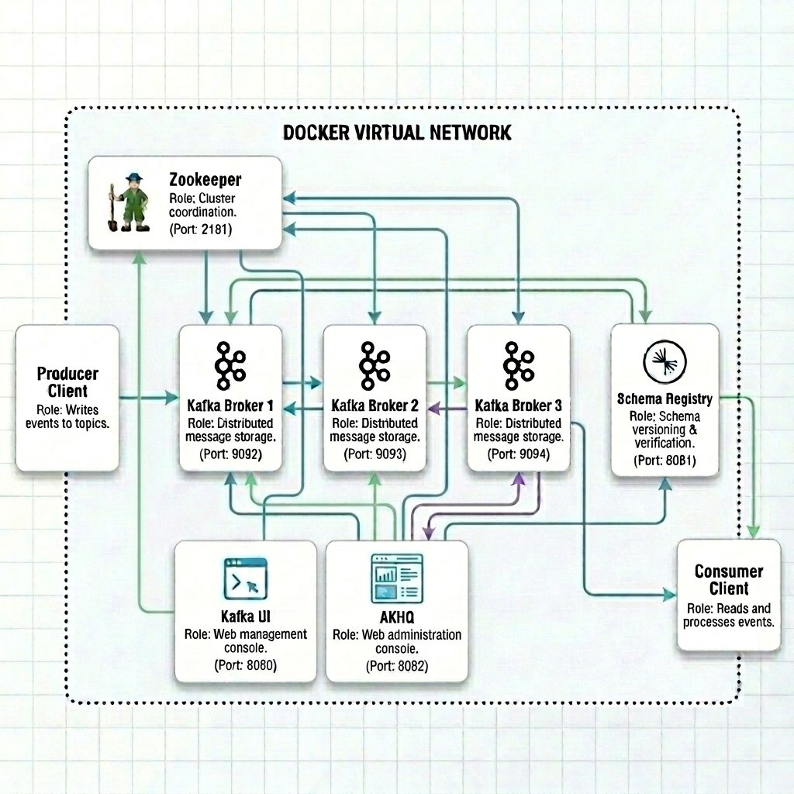

# Kafka Cluster Stack User Guide

This document explains the Docker Compose setup for an Apache Kafka cluster using:

- Apache Kafka
- Zookeeper
- Kafka UI
- AKHQ
- Confluent Schema Registry

The setup provides a complete local development environment with observability into Kafka brokers, topics, partitions, replication, and schema registration.

## Folder structure

```text
kafka-cluster
├── Readme.md
├── docker-compose.yaml
├── kafka_runtime_architecture.png
└── start.sh
```

---

# Solution Overview

This environment creates:

| Component      | Purpose                              |
| -------------- | ------------------------------------ |
| Zookeeper      | Kafka cluster coordination           |
| Kafka Brokers  | Distributed messaging platform       |
| Schema Registry| Schema versioning & verification     |
| Kafka UI       | Web UI for Kafka administration      |
| AKHQ           | Web UI for Kafka administration      |

---

# High-Level Architecture



---

# Services Explained

# 1. Zookeeper

## Purpose

Zookeeper manages:

- Broker coordination
- Cluster metadata
- Leader election
- Topic metadata
- Broker registration

---

## Configuration

```yaml
ZOOKEEPER_CLIENT_PORT: 2181
ZOOKEEPER_TICK_TIME: 2000
```

### Meaning

| Property              | Description                |
| --------------------- | -------------------------- |
| ZOOKEEPER_CLIENT_PORT | Port used by Kafka brokers |
| ZOOKEEPER_TICK_TIME   | Internal timing interval   |

---

# 2. Kafka Brokers

The cluster contains:

- kafka1
- kafka2
- kafka3

Each broker has:

- External listener
- Internal listener
- Replication support

---

# Kafka Listener Architecture

## Internal Listener

Example:

```yaml
INTERNAL://0.0.0.0:29092
```

Used for:

- Broker-to-broker communication
- Internal Docker networking

---

## External Listener

Example:

```yaml
EXTERNAL://0.0.0.0:9092
```

Used for:

- External Kafka clients
- Producers
- Consumers
- Applications outside Docker

---

# Advertised Listeners

Example:

- Assuming that your current IP address is 192.168.1.85
- Replace this with your actual IP address

```yaml
KAFKA_ADVERTISED_LISTENERS: INTERNAL://kafka1:29092,
  EXTERNAL://192.168.1.85:9092
```

This is one of the most important Kafka configurations.

---

## Why Advertised Listeners Matter

Kafka clients first connect to a bootstrap server.

Kafka then returns:

- Actual broker addresses
- Partition leaders
- Cluster metadata

If the advertised listener is wrong:

- Clients cannot connect
- Topic listing fails
- Producers fail
- Consumers disconnect

---

## Internal vs External Networking

| Listener Type | Used By                      |
| ------------- | ---------------------------- |
| INTERNAL      | Kafka brokers inside Docker  |
| EXTERNAL      | External systems and laptops |

---

# Replication Settings

```yaml
KAFKA_OFFSETS_TOPIC_REPLICATION_FACTOR: 3
KAFKA_TRANSACTION_STATE_LOG_REPLICATION_FACTOR: 3
KAFKA_TRANSACTION_STATE_LOG_MIN_ISR: 2
```

---

## Explanation

### OFFSETS_TOPIC_REPLICATION_FACTOR

Replicates consumer offsets across all brokers.

---

### TRANSACTION_STATE_LOG_REPLICATION_FACTOR

Replicates transactional metadata.

---

### MIN_ISR

Minimum number of replicas that must acknowledge writes.

This improves reliability.

---

# Auto Topic Creation

```yaml
KAFKA_AUTO_CREATE_TOPICS_ENABLE: 'true'
```

Kafka automatically creates topics when producers publish to non-existing topics.

Useful for:

- Development
- Learning
- Testing

Not recommended for production.

---

---

# Kafka UI

Kafka UI provides:

- Topic browsing
- Message viewing
- Consumer group monitoring
- Partition inspection
- Broker monitoring

---

# Access Kafka UI

## URL

```text
http://localhost:8080
```

Or:

```text
http://192.168.1.85:8080
```

---

# AKHQ

AKHQ provides a graphical interface to view topics, messages, consumer groups, configurations, and schema registries.

---

# Access AKHQ

## URL

```text
http://localhost:8082
```

Or:

```text
http://192.168.1.85:8082
```

---

# Confluent Schema Registry

Confluent Schema Registry provides a serving layer for your metadata. It provides a RESTful interface for storing and retrieving Avro, JSON Schema, and Protobuf schemas.

---

# Schema Registry Port

```text
8081
```

---

# Verifying Schema Registry

You can check the registered subjects in the schema registry by calling its REST API:

```bash
curl http://localhost:8081/subjects
```

---

# Starting the Environment

## Start All Services

```bash
docker compose up -d
```

---

# Verify Containers

```bash
docker ps
```

Expected containers:

- zookeeper
- kafka1
- kafka2
- kafka3
- schema-registry
- kafka-ui
- akhq

---

# Kafka Topic Operations

# Create Topic

```bash
docker exec kafka1 kafka-topics \
  --bootstrap-server localhost:9092 \
  --create \
  --topic orders \
  --partitions 3 \
  --replication-factor 3
```

---

# List Topics

```bash
docker exec kafka1 kafka-topics \
  --bootstrap-server localhost:9092 \
  --list
```

---

# Describe Topic

```bash
docker exec kafka1 kafka-topics \
  --bootstrap-server localhost:9092 \
  --describe \
  --topic orders
```

---

# Produce Messages

```bash
docker exec -it kafka1 kafka-console-producer \
  --bootstrap-server localhost:9092 \
  --topic orders
```

---

# Consume Messages

```bash
docker exec -it kafka2 kafka-console-consumer \
  --bootstrap-server localhost:9093 \
  --topic orders \
  --from-beginning
```

---

# Consumer Group Monitoring

## List Groups

```bash
docker exec kafka1 kafka-consumer-groups \
  --bootstrap-server localhost:9092 \
  --list
```

---

## Describe Group

```bash
docker exec kafka1 kafka-consumer-groups \
  --bootstrap-server localhost:9092 \
  --describe \
  --group order-processors
```

---

# Monitoring Scenarios

# Scenario 1: Monitor Consumer Lag

Observe in Kafka UI (Consumer Groups tab):

- Consumer group partition offsets and lag
- Active members and client IDs
- Slow or stuck consumers

---

# Scenario 2: Monitor Broker Health

Observe:

- Offline brokers
- Under replicated partitions
- ISR issues

---

# Scenario 3: JVM Pressure

Observe:

- Heap growth
- GC frequency
- Thread count

---

# Scenario 4: High Throughput

Observe:

- Bytes in/out
- Request rate
- Network utilization

---

# Troubleshooting

---

# Problem: Kafka UI Shows No Brokers

Verify:

```yaml
KAFKA_CLUSTERS_0_BOOTSTRAPSERVERS
```

matches internal broker addresses.

---

# Problem: External Clients Cannot Connect

Verify:

```yaml
KAFKA_ADVERTISED_LISTENERS
```

contains the correct host IP.

---


# Problem: Consumer Lag Keeps Growing

Possible causes:

- Slow consumers
- Too few consumers
- Large messages
- Broker bottlenecks

---

# Learning Exercises

# Exercise 1

Generate heavy producer traffic.

Observe:

- Message rate
- Network traffic
- CPU usage

---

# Exercise 2

Kill one broker.

Observe:

- Leader election
- Replica reassignment
- Under replicated partitions

---

# Exercise 3

Start multiple consumers in same group.

Observe:

- Rebalancing
- Partition distribution
- Consumer lag

---

# Important Production Notes

This setup is excellent for:

- Learning Kafka
- Kafka internals exploration
- Consumer lag analysis
- Distributed systems education

However, for production systems, additional improvements are recommended:

- Persistent storage volumes
- TLS/SSL security
- SASL authentication
- Log aggregation
- Resource limits
- Backup strategies

---

# Final Outcome

By using this environment, you can learn:

- Kafka cluster architecture
- Topic replication
- Partition leadership
- Consumer group balancing
- Kafka observability
- Kafka performance analysis
- Distributed system troubleshooting
- Fault tolerance and recovery
