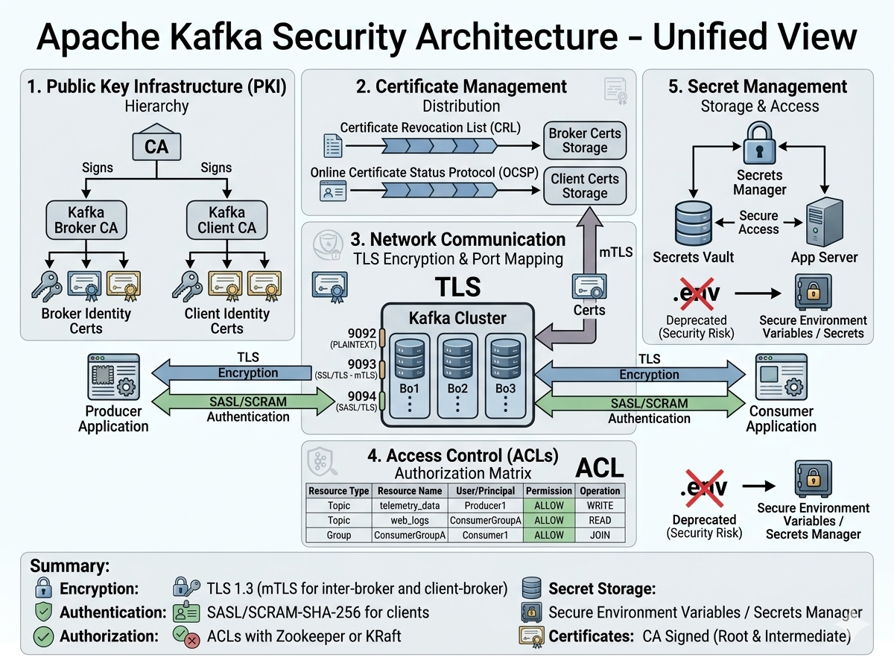

# Kafka Cluster Security Setup Guide (SASL/SCRAM + TLS + ACLs)

## Overview

This guide secures a 3-broker Kafka cluster using:

- TLS Encryption
- SASL/SCRAM-SHA-256 Authentication
- ACL-based Authorization
- Environment-based Secret Management
- Mutual TLS Authentication

Security Layers:

| Layer             | Technology             |
| ----------------- | ---------------------- |
| Encryption        | TLS                    |
| Authentication    | SASL/SCRAM-SHA-256     |
| Authorization     | ACLs                   |
| Secret Storage    | .env                   |
| Certificate Trust | CA Signed Certificates |

# Directory Structure

```text
kafka-secure/
├── .env
├── docker-compose.yml
├── certs/
│   ├── ca-cert.pem
│   ├── ca-key.pem
│   ├── kafka.server.keystore.jks
│   ├── kafka.server.truststore.jks
│   ├── kafka.client.keystore.jks
│   └── kafka.client.truststore.jks
│
├── security/
│   ├── kafka_server_jaas.conf.template
│   └── generate-jaas.sh
│
├── scripts/
│   ├── init-scram-users.sh
│   ├── create-topic.sh
│   └── setup-acls.sh
│
├── producer/
│   └── producer.properties
│
└── consumer/
    └── consumer.properties
```

# Step 1 - Create Environment File

Create `.env`

```properties
# SCRAM Users

ADMIN_USER=admin
ADMIN_PASSWORD=admin-secret

PRODUCER_USER=producer
PRODUCER_PASSWORD=producer-secret

CONSUMER_USER=consumer
CONSUMER_PASSWORD=consumer-secret

# TLS Passwords

KEYSTORE_PASSWORD=changeit
TRUSTSTORE_PASSWORD=changeit
KEY_PASSWORD=changeit
```

# Step 2 - Generate TLS Certificates

## Create Certificate Authority

```bash
openssl req \
  -new \
  -x509 \
  -nodes \
  -days 3650 \
  -keyout ca-key.pem \
  -out ca-cert.pem
```

## Generate Broker Keystore

```bash
keytool \
-genkey \
-alias kafka1 \
-keystore kafka.server.keystore.jks \
-storepass changeit \
-keypass changeit \
-dname "CN=kafka1"
```

## Generate CSR

```bash
keytool \
-certreq \
-alias kafka1 \
-file kafka1.csr \
-keystore kafka.server.keystore.jks \
-storepass changeit
```

## Sign Certificate

```bash
openssl x509 \
-req \
-CA ca-cert.pem \
-CAkey ca-key.pem \
-in kafka1.csr \
-out kafka1-signed.crt \
-days 3650 \
-CAcreateserial
```

## Import CA

```bash
keytool \
-import \
-alias CARoot \
-file ca-cert.pem \
-keystore kafka.server.keystore.jks \
-storepass changeit \
-noprompt
```

## Import Signed Certificate

```bash
keytool \
-import \
-alias kafka1 \
-file kafka1-signed.crt \
-keystore kafka.server.keystore.jks \
-storepass changeit \
-noprompt
```

## Create Truststore

```bash
keytool \
-import \
-alias CARoot \
-file ca-cert.pem \
-keystore kafka.server.truststore.jks \
-storepass changeit \
-noprompt
```

Repeat for:

- kafka2
- kafka3
- producer
- consumer

# Step 3 - JAAS Template

Create:

`security/kafka_server_jaas.conf.template`

```java
KafkaServer {
  org.apache.kafka.common.security.scram.ScramLoginModule required
  username="${ADMIN_USER}"
  password="${ADMIN_PASSWORD}";
};

Client {
  org.apache.zookeeper.server.auth.DigestLoginModule required
  username="kafka"
  password="kafka-secret";
};
```

# Step 4 - Generate JAAS at Runtime

Create:

`security/generate-jaas.sh`

```bash
#!/bin/bash

envsubst \
< /etc/kafka/secrets/kafka_server_jaas.conf.template \
> /etc/kafka/secrets/kafka_server_jaas.conf

exec /etc/confluent/docker/run
```

```bash
chmod +x security/generate-jaas.sh
```

# Step 5 - Kafka Initialization Service

```yaml
kafka-init:
  image: confluentinc/cp-kafka:7.5.0

  env_file:
    - .env

  command: >
    bash -c "
      cub zk-ready zookeeper:2181 120 &&

      kafka-configs \
      --zookeeper zookeeper:2181 \
      --alter \
      --add-config 'SCRAM-SHA-256=[iterations=8192,password=${ADMIN_PASSWORD}]' \
      --entity-type users \
      --entity-name ${ADMIN_USER} &&

      kafka-configs \
      --zookeeper zookeeper:2181 \
      --alter \
      --add-config 'SCRAM-SHA-256=[iterations=8192,password=${PRODUCER_PASSWORD}]' \
      --entity-type users \
      --entity-name ${PRODUCER_USER} &&

      kafka-configs \
      --zookeeper zookeeper:2181 \
      --alter \
      --add-config 'SCRAM-SHA-256=[iterations=8192,password=${CONSUMER_PASSWORD}]' \
      --entity-type users \
      --entity-name ${CONSUMER_USER}
    "
```

# Step 6 - Kafka Broker Configuration

For each broker:

```yaml
env_file:
  - .env
```

## Listener Configuration

```yaml
KAFKA_LISTENERS: SASL_SSL://0.0.0.0:9092

KAFKA_ADVERTISED_LISTENERS: SASL_SSL://kafka1:9092

KAFKA_LISTENER_SECURITY_PROTOCOL_MAP: SASL_SSL:SASL_SSL

KAFKA_INTER_BROKER_LISTENER_NAME: SASL_SSL
```

## SASL Settings

```yaml
KAFKA_SASL_ENABLED_MECHANISMS: SCRAM-SHA-256

KAFKA_SASL_MECHANISM_INTER_BROKER_PROTOCOL: SCRAM-SHA-256
```

## TLS Settings

```yaml
KAFKA_SSL_KEYSTORE_FILENAME: kafka.server.keystore.jks

KAFKA_SSL_KEYSTORE_CREDENTIALS: keystore_creds

KAFKA_SSL_KEY_CREDENTIALS: key_creds

KAFKA_SSL_TRUSTSTORE_FILENAME: kafka.server.truststore.jks

KAFKA_SSL_TRUSTSTORE_CREDENTIALS: truststore_creds

KAFKA_SSL_CLIENT_AUTH: required

KAFKA_SSL_ENDPOINT_IDENTIFICATION_ALGORITHM:
```

## ACL Settings

```yaml
KAFKA_AUTHORIZER_CLASS_NAME: kafka.security.authorizer.AclAuthorizer

KAFKA_ALLOW_EVERYONE_IF_NO_ACL_FOUND: 'false'

KAFKA_SUPER_USERS: User:admin
```

## Volumes

```yaml
volumes:
  - ./certs:/etc/kafka/secrets
  - ./security:/etc/kafka/security
```

# Step 7 - Admin Client Configuration

Create:

`admin.properties`

```properties
security.protocol=SASL_SSL

ssl.truststore.location=/certs/kafka.client.truststore.jks
ssl.truststore.password=changeit

ssl.keystore.location=/certs/kafka.client.keystore.jks
ssl.keystore.password=changeit
ssl.key.password=changeit

sasl.mechanism=SCRAM-SHA-256

sasl.jaas.config=org.apache.kafka.common.security.scram.ScramLoginModule required \
username="admin" \
password="admin-secret";
```

# Step 8 - Create Topic

```bash
kafka-topics \
--bootstrap-server kafka1:9092 \
--command-config admin.properties \
--create \
--topic secure-topic \
--partitions 3 \
--replication-factor 3
```

# Step 9 - Create ACLs

Producer ACL

```bash
kafka-acls \
--bootstrap-server kafka1:9092 \
--command-config admin.properties \
--add \
--allow-principal User:producer \
--operation Write \
--operation Describe \
--topic secure-topic
```

Consumer ACL

```bash
kafka-acls \
--bootstrap-server kafka1:9092 \
--command-config admin.properties \
--add \
--allow-principal User:consumer \
--operation Read \
--operation Describe \
--topic secure-topic
```

Consumer Group ACL

```bash
kafka-acls \
--bootstrap-server kafka1:9092 \
--command-config admin.properties \
--add \
--allow-principal User:consumer \
--operation Read \
--group my-consumer-group
```

# Step 10 - Producer Configuration

Create:

`producer.properties`

```properties
bootstrap.servers=kafka1:9092,kafka2:9092,kafka3:9092

security.protocol=SASL_SSL

ssl.truststore.location=/certs/kafka.client.truststore.jks
ssl.truststore.password=changeit

ssl.keystore.location=/certs/kafka.client.keystore.jks
ssl.keystore.password=changeit

ssl.key.password=changeit

sasl.mechanism=SCRAM-SHA-256

sasl.jaas.config=org.apache.kafka.common.security.scram.ScramLoginModule required \
username="producer" \
password="producer-secret";

acks=all
enable.idempotence=true
```

# Step 11 - Consumer Configuration

Create:

`consumer.properties`

```properties
bootstrap.servers=kafka1:9092,kafka2:9092,kafka3:9092

security.protocol=SASL_SSL

ssl.truststore.location=/certs/kafka.client.truststore.jks
ssl.truststore.password=changeit

ssl.keystore.location=/certs/kafka.client.keystore.jks
ssl.keystore.password=changeit

ssl.key.password=changeit

sasl.mechanism=SCRAM-SHA-256

sasl.jaas.config=org.apache.kafka.common.security.scram.ScramLoginModule required \
username="consumer" \
password="consumer-secret";

group.id=my-consumer-group

auto.offset.reset=earliest
```

# Step 12 - Test Producer

```bash
kafka-console-producer \
--bootstrap-server kafka1:9092 \
--topic secure-topic \
--producer.config producer.properties
```

# Step 13 - Test Consumer

```bash
kafka-console-consumer \
--bootstrap-server kafka1:9092 \
--topic secure-topic \
--group my-consumer-group \
--consumer.config consumer.properties \
--from-beginning
```

# Security Architecture



## 1. Encryption (TLS)

- Data in Transit: All communication between Producers, Consumers, and the Kafka Cluster is encrypted using TLS to prevent wiretapping.
- Port Mapping: Different traffic types use dedicated ports (e.g., 9093 for TLS/mTLS, 9094 for SASL/TLS) to isolate secure channels.

## 2. Authentication & Certificates

- Client & Broker Identity: A Certificate Authority (CA) signs digital certificates to verify the true identity of both brokers and clients.
- SASL/SCRAM: Clients authenticate themselves using username/password pairs secured via the SCRAM-SHA-256 hashing mechanism over the encrypted TLS channel.

## 3. Authorization (ACLs)

- Access Control Lists: Once authenticated, ACLs act as a security gatekeeper.
- Permission Matrix: They explicitly define which user or application is allowed to perform specific operations (like WRITE or READ) on specific resources (like a database topic).

## 4. Secret Storage (Security Upgrade)

- The Risk: Storing sensitive passwords and credentials in plaintext .env files is a high security risk.
- The Fix: Modern architectures migrate from .env files to external, encrypted Secrets Vaults or native Secrets Managers to safely inject credentials into the application servers at runtime.

# Verification Checklist

- ✅ TLS Enabled
- ✅ SCRAM Authentication Enabled
- ✅ ACL Authorization Enabled
- ✅ Inter-Broker Encryption Enabled
- ✅ Client Encryption Enabled
- ✅ Secrets Externalized to .env
- ✅ Mutual TLS Enabled
- ✅ Topic-Level Authorization Enabled
- ✅ Consumer Group Authorization Enabled
- ✅ Production-Ready Security Baseline
